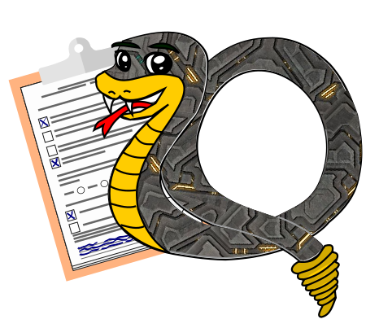
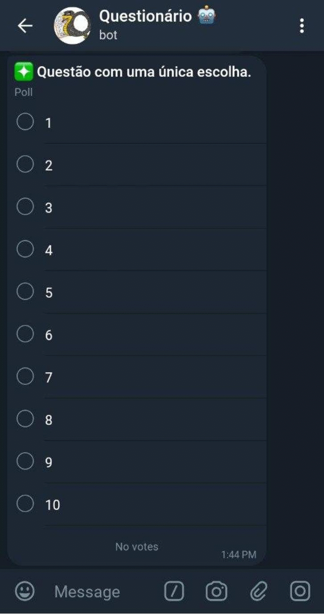

#  Questionário Bot

Bot questionário utilizado para permitir os usuários avaliarem meus bots.

## Template

Esse bot permite três tipos de perguntas:

- Pergunta que permite a seleção de múltiplas escolhas
- Pergunda que permite a seleção de no máximo uma das opções
- Pergunta que permite o usuário responder com suas próprias palavras.
  - Apenas uma mensagem por resposta.

As perguntas são lidas a partir de um arquivo JSON no padrão `survey_{nome_do_bot}.json`, onde o `nome_do_bot` também se refere ao nome da tabela (é necessária a criação da tabela antecipadamente).
